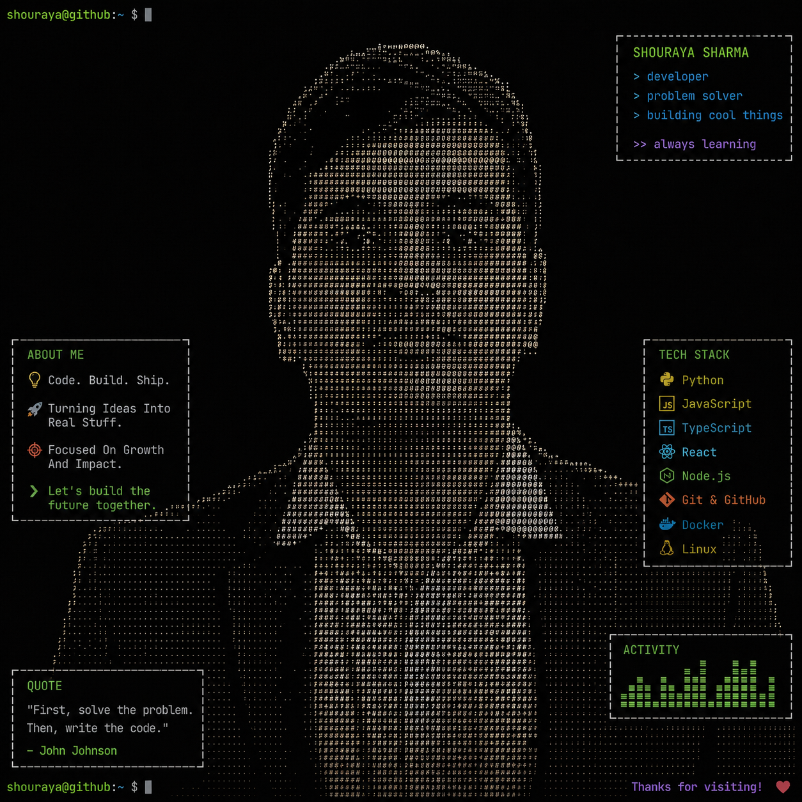

  

  

  

---

### 🛠️ Tech Stack

**Languages**

  

**Web Development**

  

  
  

**Databases & Tools**

  

  
  
  
  

**ML & Data Science**

  

  
  
  
  

**Concepts**

  
  
  
  
  
  
  
  
  
  

---

### 📊 Activity

  

  

  

---

  <code>shouraya@github:~ $</code> _ 
  <b>Thanks for visiting!</b> ❤️

